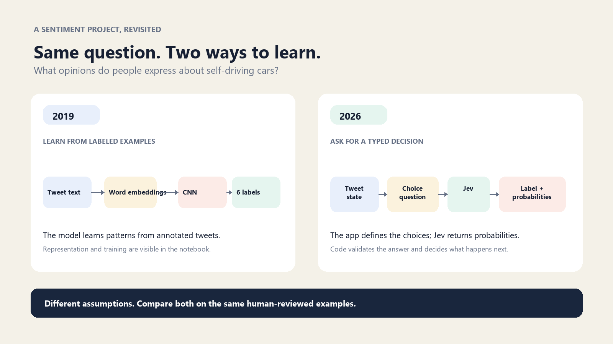
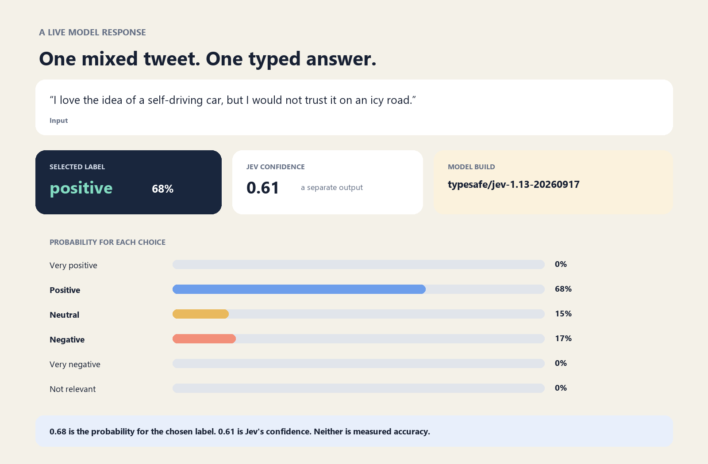

# From Word2Vec and CNNs to Typed Decisions: Revisiting My 2019 Sentiment Project

*I reopened one of my first deep learning projects to see what changes when the model interface changes.*

In 2019, one of my first deep learning courses gave me a project I still think about: could I recognize people’s opinions about self-driving cars from tweets?

I cleaned and tokenized text, explored Word2Vec and GloVe embeddings, and trained a Keras convolutional neural network. I liked how visible the pipeline was: text became vectors, vectors went through layers, and the model learned to distinguish six outcomes.

Recently, I reopened the project and asked a different question: what would it look like to approach that same task with a newer kind of AI system?

## The original project

The dataset is more nuanced than a simple positive/negative label. It includes five sentiment levels, plus `not_relevant` for tweets outside the self-driving-car topic. The conversations are from 2015, so I think of them as a historical dataset for studying methods, not as a measure of what people think about autonomous cars today.

My notebook experimented with word embeddings and a CNN with a six-class softmax output. That was a useful first deep learning project because it made the full pipeline visible: data, preprocessing, representation, model, prediction. It also left me with a snapshot of how I was learning in 2019.



*The question stays the same while the model interface changes.*

I’ve kept this project about tweets because that’s what the original dataset and annotation scheme cover. It’s tempting to call this “social media sentiment” more generally, but the data are historical tweets about self-driving cars. The code can accept any short text; that alone doesn’t show it will work on posts from other platforms or topics.

## The 2026 experiment

For the new version, I kept the original question and used TypeSafe’s Jev decision model through OpenRouter. The application sends the tweet as state, defines six possible sentiment outcomes, and asks Jev to choose one. The response contains a typed answer, probabilities for the options, and a confidence signal.

This feels different from asking a chat model to “analyze this tweet.” The application defines the shape of the answer up front. The software gets a choice it can use directly, alongside a probability distribution it can inspect.

Jev does not generate an explanation or decide what the rest of the application should do. Code defines the task, sends the request, validates the response, and decides what happens next. That separation is what I wanted to explore.

## Why typed decisions are interesting

Many applications do not need another paragraph. They need to route a request, choose a category, score a risk, or decide whether a condition is met. A typed decision can make that boundary clearer: the application defines the options, reads the answer, and applies its own policy.

But a fixed schema is not the same as a correct answer. Jev can choose the wrong option, and confidence should not be confused with accuracy. The task still needs thoughtful labels, representative evaluation data, and careful application logic.

That is where this project becomes useful to me as a learning exercise. I can compare two approaches on the same historical question: a CNN trained with labeled examples and Jev making a zero-shot decision at request time. The new path is not automatically better. It has different assumptions and dependencies, including a hosted API and usage billed through OpenRouter.

## Getting Jev running through OpenRouter

If you haven’t used OpenRouter before, [create an account](https://openrouter.ai/), add credits if needed on [Settings → Credits](https://openrouter.ai/settings/credits), and create an API key in [Settings → Keys](https://openrouter.ai/settings/keys). I’d set a spending limit on the key while experimenting. Jev is available through OpenRouter, so this project doesn’t need a separate TypeSafe account. Requests are billed to the OpenRouter account attached to your key.

From the repository, move into the `jev` folder and set `OPENROUTER_API_KEY` in the same terminal where you’ll run the script. In PowerShell, this asks for the key without echoing it:

```powershell
Set-Location jev
$secureKey = Read-Host "OpenRouter API key (input is hidden)" -AsSecureString
$env:OPENROUTER_API_KEY = [System.Net.NetworkCredential]::new("", $secureKey).Password
python sentiment.py --text "I love the idea of a self-driving car, but I would not trust it on an icy road."
Remove-Item Env:OPENROUTER_API_KEY
Remove-Variable secureKey
```

In macOS or Linux, export the key in your terminal, then run the same command:

```bash
cd jev
export OPENROUTER_API_KEY="your-api-key"
python sentiment.py --text "I love the idea of a self-driving car, but I would not trust it on an icy road."
```

The demo returns the selected class, probabilities for all six options, confidence, model build, and usage details. Here’s the result from one run of the mixed example above:



*One actual response from Jev 1.13. The probabilities and confidence are separate returned values; neither is measured accuracy.*

The result is interesting because the tweet contains both excitement and doubt. Jev selected `positive` with probability 0.68, while assigning 0.17 to `negative` and 0.15 to `neutral`. That’s a useful prompt for discussion: which label would a human annotator choose, and what does the old rubric mean by a rating of 4? It isn’t evidence that the classification is correct. Try a factual observation or an off-topic car tweet next, and compare the distributions.

## What I want to learn next

The interesting next step is a fair comparison. I would run both approaches on the same human-reviewed holdout set, preserve the original label definitions, and report per-class precision and recall along with macro-F1. I would also look at disagreements and compare confidence with observed correctness instead of assuming they are the same thing. If I broadened this to other social-media posts, I’d first revisit the label descriptions and build a new reviewed evaluation set for that scope.

For me, the best part of revisiting this work is seeing how the questions changed. In 2019, I was learning how to build a deep learning pipeline from text. Now I’m asking how a model’s interface changes the way software can use its output—and how to evaluate that change without overstating what a demo proves.

The original notebook is still there, alongside one Jev companion and a learning lab. If you try it, I’d love to hear what old ML project you would revisit with today’s tools.

### Helpful resources

- [Original tweet sentiment analysis project](https://github.com/riacheruvu/Tweets_Sentiment_Analysis) and [dataset](https://raw.githubusercontent.com/riacheruvu/Tweets_Sentiment_Analysis/master/Twitter-sentiment-self-drive-DFE-dataset.csv)
- [OpenRouter Jev models](https://openrouter.ai/typesafe)
- [Create an OpenRouter API key](https://openrouter.ai/settings/keys)
- [How to use Jev through OpenRouter](https://openrouter.ai/blog/tutorials/how-to-use-jev/)
- [OpenRouter Decisions API](https://openrouter.ai/docs)
